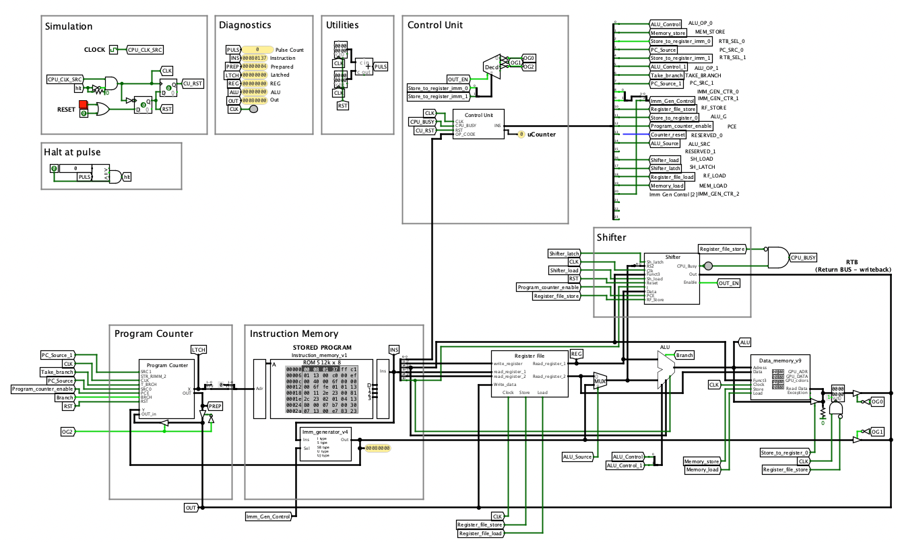

# Logisim Simulation

Simulation of Pineapple ONE CPU in Logisim-Evolution 4.0.4.HC.

I have tried to make this simulation as accurate to actual hardware as possible - ROM content is exactly the same, and most of the hardware as well, but some things just could not be done in current version of Logisim, for example the VGA output.

How to run a program:
* If the instructiom memory EEPROM is empty, load a new program in it. 
* Reset the CPU (⌘ + R)
* Manually clock the CPU, or turn on auto-tick (⌘ + K)
* The CPU will now execute the current program